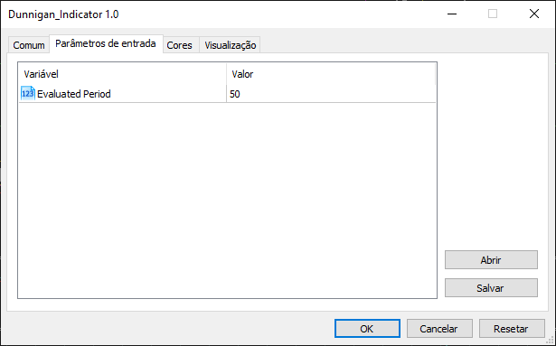

----
## MetaTrader 5 > Indicator > Dunnigan

### Description:
This is a trend indicator based on a strategy created by William Dunnigan that emit signals to buy or sell on any timeframe and can assist in decision making for trading on stock market or Forex.

The signals are fired accordingly to the following rules:

* **Buy Signal** = Fired at the **first candlestick** in which *close price* is higher than the *higher price* of the last candlestick. The *higher and lower prices* of the current candlestick must be higher than the corresponding ones of the last candlestick as well.

* **Sell Signal** = Fired at the **first candlestick** in which *close price* is lower than the *lower price* of the last candlestick. The *higher and lower prices* of the current candlestick must be lower than the corresponding ones of the last candlestick as well.

### Parameters:

* **Evaluated Period** = Number of candlesticks to be evaluated. Defaults to 50.

----
### Instructions:
1. Double-click on *mq5* file should open **MetaEditor**.
2. Click *'Compile'* button on **MetaEditor**.
3. On **MetaTrader**, insert this compiled indicator into the chart you want.

----
### References:
* [MQL5 Documentation](https://www.mql5.com/en/docs)

### MQL5 Market:
* [My MQL5 Published Products](https://www.mql5.com/en/users/leonardo_splinter/seller)